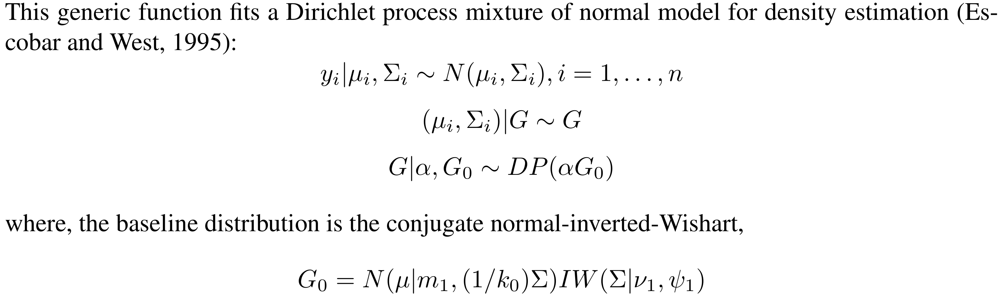

```{r setup, include=FALSE}
knitr::opts_chunk$set(echo=FALSE)
knitr::opts_chunk$set(cache=TRUE)
options(width = 50)

library(salso)
iris.clusterings <- unname(iris.clusterings)
tmp <- iris.clusterings[1,]
iris.clusterings[1,] <- iris.clusterings[13,]
iris.clusterings[13,] <- tmp
```

## Motivation

- In a typical Bayesian analysis, considerable effort is placed
on "**fitting the model**" (e.g., sampling from the posterior)
but this is **only half of the inference problem**.

- Meaningful inference also requires **summarizing the posterior distribution** of
the parameters of interest for, e.g., subsequent analysis or communicating results.

- If the parameters of interest live in $\mathbb{R}^n$, common
posterior summaries are **means** and **medians**.

- Summarizing posterior distributions of parameters with **complicated structure**
is more challenging, e.g., the "average" clustering, feature allocation, or network
is not easily defined.

- In this paper, we consider summarizing distributions over partitions.

# Setting the Stage

## MCMC Samples from the Posterior Clustering Distribution

```latex
      [,1] [,2] [,3] [,4] [,5] [,6] [,7] [,8] [,9] [,10]
 [1,]    0    0    0    1    0    0    0    1    0     1
 [2,]    0    1    1    1    0    0    0    1    0     0
 [3,]    0    1    0    0    1    1    0    1    1     1
 [4,]    0    1    2    1    1    1    2    1    1     1
 [5,]    0    0    0    1    0    2    1    3    0     0
 [6,]    0    0    0    0    1    0    0    0    1     0
 [7,]    0    0    1    0    2    3    0    0    3     0
 [8,]    0    0    0    0    1    0    0    2    0     0
 [9,]    0    0    0    1    2    0    0    0    2     0
[10,]    0    0    1    1    2    2    1    1    3     1
[11,]    0    1    0    0    1    1    1    2    1     0
[12,]    0    0    1    0    2    2    2    2    2     0
[13,]    0    0    0    0    1    2    0    0    2     0
[14,]    0    0    1    0    1    0    0    0    1     0
[15,]    0    0    0    0    1    1    0    0    1     0
[16,]    0    0    0    0    1    0    0    0    1     0
[17,]    0    0    1    1    0    0    1    0    0     1
[18,]    0    1    1    1    0    0    1    1    0     1
[19,]    0    1    0    0    1    1    0    1    1     1
[20,]    0    1    0    0    2    1    0    0    1     0
```


## Example: First Clustering in MCMC Output

Clustering in **_cluster label_** notation:
$$c^{(1)} = (1,2,1,2,2)$$

Clustering in **_set partition_** notation:
$$\pi^{(1)} = \{ \{ 1, 3\}, \{2, 4, 5\} \}$$

Clustering in **_adjacency matrix_** notation;
$$
A(c^{(1)}) = 
\begin{bmatrix}
1 & 0 & 1 & 0 & 0\\
0 & 1 & 0 & 1 & 1\\
1 & 0 & 1 & 0 & 0\\
0 & 1 & 0 & 1 & 1\\
0 & 1 & 0 & 1 & 1\\
\end{bmatrix}
$$

## Example: Second Clustering in MCMC Output

Clustering in **_cluster label_** notation:
$$c^{(2)} = (1,1,1,2,3)$$

Clustering in **_set partition_** notation:
$$\pi^{(2)} = \{ \{ 1, 2, 3\}, \{4\}, \{5\} \}$$

Clustering in **_adjacency matrix_** notation:
$$
A(c^{(2)}) = 
\begin{bmatrix}
1 & 1 & 1 & 0 & 0\\
1 & 1 & 1 & 0 & 0\\
1 & 1 & 1 & 0 & 0\\
0 & 0 & 0 & 1 & 0\\
0 & 0 & 0 & 0 & 1\\
\end{bmatrix}
$$

## Example: Third Clustering in MCMC Output

Clustering in **_cluster label_** notation:
$$c^{(3)} = (1,1,2,1,2)$$

Clustering in **_set partition_** notation:
$$\pi^{(3)} = \{ \{1, 2, 4\}, \{3, 5\} \}$$

Clustering in **_adjacency matrix_** notation:
$$
A(c^{(3)}) = 
\begin{bmatrix}
1 & 1 & 0 & 1 & 0\\
1 & 1 & 0 & 1 & 0\\
0 & 0 & 1 & 0 & 1\\
1 & 1 & 0 & 1 & 0\\
0 & 0 & 1 & 0 & 1\\
\end{bmatrix}
$$
<!--
## Homegrown Motivating Example


## Prototypical Bayesian Nonparametric Model



## R Demonstration
-->

## Example: Averaging the MCMC Clustering Output
 
Averaging the vector of cluster labels **does not make sense**.

Averaging the set partitions is **not defined**.

Averaging adjacency matrices **does** make sense:
$$
\bar{A} = \frac{1}{B} \sum_{b=1}^B A(c^{(b)}) = 
\begin{bmatrix}
1 & 2/3 & 2/3 & 1/3 & 0\\
2/3 & 1 & 1/3 & 2/3 & 1/3\\
2/3 & 1/3 & 1 & 0 & 1/3\\
1/3 & 2/3 & 0 & 1 & 1/3\\
0 & 1/3 & 1/3 & 1/3 & 1\\
\end{bmatrix}
$$
$\bar{A}$ is the **pairwise similarity matrix (PSM)**.  Denote $\hat{\mu}_{ij}$ as it's $(i,j)$ element,
which estimates $\mu_{ij} = \text{Pr}( c_i = c_j \mid \text{data})$.

<!--
## More Realistic Example

Suppose MCMC output contains 1,000 posterior samples for the partition of 150 observations (encoded with cluster labels), e.g.:
```{r, echo=TRUE}
iris.clusterings[1,]
```
What is the Bayes estimate of the partition from these 1,000 samples?
-->

## Overview

- We present the **sequentially-allocated latent structure optimization (SALSO)** method to
minimize an objective criterion to obtain a *point estimate* based on a collection of randomly-sampled
*clusterings/partitions*.

- SALSO is a *stochastic search* method involving a *series of micro optimizations*.

<!-- - The method can be applied to *clusterings*, *feature allocations*, *networks*, etc. -->

- Currently implementation handles two loss functions:
    - "binder": Loss function of Binder (1978) loss
    - "VI.lb": Lower bound of the variation of information loss of Wade & Ghahramani (2018).

## Loss Functions and Bayes Estimators

- A Bayes estimator minimizes the posterior expected value of a loss function.

- The 0-1 loss function:
  $$L(c,\hat{c}) = \I{c = \hat{c}},$$
  yielding the maximum _a posteriori_ (MAP) clustering:
  $$\text{argmax}_{\hat{c}} \ p(\hat{c} \given \text{data})$$
    - Equal loss for clusterings that differs by one label and clusterings that differs by many labels!?
    - Mode may not represent well the ``center'' of a distribution.
        
## Loss Functions and Bayes Estimators

- Dahl (2006) suggested the clustering that minimizes:
    $$f_\text{lsclust}(\hat{c}) = \sum_{i=1}^n \sum_{j=1}^n ( A(\hat{c})_{ij} - \hat{\mu}_{ij} )^2,$$
    where $\hat{\mu}_{ij}$ is a Monte Carlo estimate of $\mu_{ij} = Pr(c_i = c_j)$.
- Lau & Green (2007) studied the Binder (1978) loss function in a Bayesian nonparametric context:
    $$L(c,\hat{c}) = \sum_{i<j} \I{c_i     = c_j} \ \I{\hat{c}_i \not= \hat{c}_j} +
                                \I{c_i \not= c_j} \ \I{\hat{c}_i     = \hat{c}_j},$$
    yielding a clustering minimizing the Monte Carlo estimate of the expectation of the Binder loss:
    $$f_\text{binder}(\hat{c}) = \sum_{i=1}^n \sum_{j=1}^n \I{\hat{c}_i=\hat{c}_j} ( 0.5 - \hat{\mu}_{ij} )$$
- Dahl & Newton (2007) noted that minimizing $f_\text{lsclust}$ is
equivalent to minimizing $f_\text{binder}$.
    
## Loss Functions and Bayes Estimators

- Wade & Ghahramani (2018) suggested the variation of information of Meilă (2007) as
    a loss function:
    $$\begin{split}L(c,\hat{c}) = \sum_{i=1}^n \bigg( & \log\bigg(\sum_{j=1}^n \I{\hat{c}_j = \hat{c}_i}\bigg) \\
      & - 2 \text{E} \bigg( \log \bigg( \sum_{j=1}^n \I{\hat{c}_j = \hat{c}_i, c_j = c_i} \bigg) \bigg| \text{data} \bigg) \bigg)\end{split}$$
    which is computationally expensive.  Instead,
    minimize the Monte Carlo estimate of the **lower bound** of the posterior expectation of the variation
    of information loss (VI.lb):
    $$f_\text{VI.lb}(\hat{c}) = \sum_{i=1}^n \bigg( \log\bigg(\sum_{j=1}^n \I{\hat{c}_j = \hat{c}_i}\bigg)
      - 2 \log \bigg( \sum_{j=1}^n \I{\hat{c}_j = \hat{c}_i} \hat{\mu}_{ij} \bigg) \bigg)$$
- Paulon, Trippa, Müller (2018) propose a scientifically-tailored loss function.

## Monte Carlo Estimate the Posterior Expected Loss

- For a given $\hat{c}$, both the Binder and the lower bound of the VI objective functions are based on the $\hat{\mu}_{ij}$'s.
- But having a way to estimate the posterior expected loss **for a given $\hat{c}$** does _not_ give
a search algorithm for its minimization.

## Methods for Optimization Given a Loss Function

1. Exhaustive search. Feasible for small $n$ only, e.g., $B(15) = 1,382,958,545$.
2. Round the elements of the adjacency matrix.  May not lead to a clustering, e.g.:
$$
\bar{A} = 
\begin{bmatrix}
1 & 2/3 & 2/3 & 1/3 & 0\\
2/3 & 1 & 1/3 & 2/3 & 1/3\\
2/3 & 1/3 & 1 & 0 & 1/3\\
1/3 & 2/3 & 0 & 1 & 1/3\\
0 & 1/3 & 1/3 & 1/3 & 1\\
\end{bmatrix}
\Rightarrow
\begin{bmatrix}
1 & 1 & 1 & 0 & 0\\
1 & 1 & 0 & 1 & 0\\
1 & 0 & 1 & 0 & 0\\
0 & 1 & 0 & 1 & 0\\
0 & 0 & 0 & 0 & 1\\
\end{bmatrix}
$$
3. Medvedovic and Sivaganesan (2002) selected a clustering using hierarchal
clustering using $1-\bar{A}$ as the distance matrix.
4. Dahl (2006) selected the clustering in the MCMC output that minimizes the objective function.

## Methods for Optimization Given a Loss Function

5. Lau & Green (2007) proposed a heuristic item-swapping algorithm based on binary integer programming to minimize the posterior expectation of Binder loss.

6. Wade & Ghahramani (2018) proposed a greedy search algorithm based on neighborhoods defined by the Hasse diagram, which can be used for Binder or VI.lb loss.

7. We propose the **sequentially-allocated latent structure optimization (SALSO)** method to perform
a *series of micro optimizations* to stochastically search for the minimizer of the posterior expectation of Binder or VI.lb loss.

# Sequentially-Allocated Latent Structure Optimization

## Sequentially-Allocated Latent Structure Optimization

- The steps of the SALSO algorithm are:
    1. Randomly sample a permutation $\Permutation = (\permutation_1,\ldots,\permutation_n)$ of $\{1,\ldots,n\}$, giving the sequence in which the $n$ items are allocated.
    2. Starting for an empty structure, build up a full structure by sequentially allocating items to minimize the objective function (but rarely make a sub-optimal allocation).
    3. Improve the full structure by a series of one-at-a-time reallocations to minimize the objective function (but, again, rarely make a sub-optimal allocation).
    4. Do the above steps many times for randomly-selected permutations and choose the structure
       that minimizes the objective function.

## Illustration of SALSO Method

- To illustrate the SALSO method, consider clustering 5 items.
- For simplicity, suppose $\Permutation = (\permutation_1,\ldots,\permutation_5) = (1,2,3,4,5)$.
- Recall the steps to SALSO are:
    1. Sample a permutation.
    2. Build up a full structure from an empty structure.
    3. Improve the full structure.
    4. Do it for many random permutations (not just $\Permutation = (1,2,3,4,5)$).

## Step 1: Sample a permutation
```latex
Permutation: 1 2 3 4 5        Item 1 is allocated first,
                              Item 2 is allocated second,
                                   etc.
```


## Step 2: Build Up a Full Structure
```latex
Clustering: ~ ~ ~ ~ ~ 
```
$$\phantom{f(\hat{c})}$$
$$\phantom{f(\hat{c})}$$
$$\phantom{f(\hat{c})}$$
$$\phantom{f(\hat{c})}$$

## Step 2: Build Up a Full Structure
```latex
Clustering: ? ~ ~ ~ ~    Candidates for ? are: 1
```
$$\phantom{f(\hat{c})}$$
$$\phantom{f(\hat{c})}$$
$$\phantom{f(\hat{c})}$$
$$\phantom{f(\hat{c})}$$

## Step 2: Build Up a Full Structure
```latex
Clustering: 1 ~ ~ ~ ~
```
$$\phantom{f(\hat{c})}$$
$$\phantom{f(\hat{c})}$$
$$\phantom{f(\hat{c})}$$
$$\phantom{f(\hat{c})}$$

## Step 2: Build Up a Full Structure
```latex
Clustering: 1 ? ~ ~ ~    Candidates for ? are: 1, 2
```
$$f(\hat{c}) = f((\texttt{1,1})) = 0.27$$
$$f(\hat{c}) = f((\texttt{1,2})) = 0.73$$
$$\phantom{f(\hat{c})}$$
$$\phantom{f(\hat{c})}$$

## Step 2: Build Up a Full Structure
```latex
Clustering: 1 1 ~ ~ ~
```
$$\phantom{f(\hat{c})}$$
$$\phantom{f(\hat{c})}$$
$$\phantom{f(\hat{c})}$$
$$\phantom{f(\hat{c})}$$

## Step 2: Build Up a Full Structure
```latex
Clustering: 1 1 ? ~ ~    Candidates for ? are: 1, 2
```
$$f(\hat{c}) = f((\texttt{1,1,1})) = 0.79$$
$$f(\hat{c}) = f((\texttt{1,1,2})) = 0.49$$
$$\phantom{f(\hat{c})}$$
$$\phantom{f(\hat{c})}$$

## Step 2: Build Up a Full Structure
```latex
Clustering: 1 1 2 ~ ~
```
$$\phantom{f(\hat{c})}$$
$$\phantom{f(\hat{c})}$$
$$\phantom{f(\hat{c})}$$
$$\phantom{f(\hat{c})}$$

## Step 2: Build Up a Full Structure
```latex
Clustering: 1 1 2 ? ~    Candidates for ? are: 1, 2, 3
```
$$f(\hat{c}) = f((\texttt{1,1,2,1})) = 1.01$$
$$f(\hat{c}) = f((\texttt{1,1,2,2})) = 0.79$$
$$f(\hat{c}) = f((\texttt{1,1,2,3})) = 0.71$$
$$\phantom{f(\hat{c})}$$

## Step 2: Build Up a Full Structure
```latex
Clustering: 1 1 2 2 ~
```
$$\phantom{f(\hat{c})}\text{Here, we took the second best.}$$
$$\phantom{f(\hat{c})}\text{We allow this for each allocation with very small probability.}$$
$$\phantom{f(\hat{c})}$$
$$\phantom{f(\hat{c})}$$

## Step 2: Build Up a Full Structure
```latex
Clustering: 1 1 2 2 ?    Candidates for ? are: 1, 2, 3
```
$$f(\hat{c}) = f((\texttt{1,1,2,2,1})) = 1.31$$
$$f(\hat{c}) = f((\texttt{1,1,2,2,2})) = 0.89$$
$$f(\hat{c}) = f((\texttt{1,1,2,2,3})) = 1.05$$
$$\phantom{f(\hat{c})}$$

## Step 2: Build Up a Full Structure
```latex
Clustering: 1 1 2 2 2
```
$$\phantom{f(\hat{c})}$$
$$\phantom{f(\hat{c})}$$
$$\phantom{f(\hat{c})}$$
$$\phantom{f(\hat{c})}$$

## Step 3: Improving the Full Structure
```latex
Clustering: 1 1 2 2 2
```
$$\phantom{f(\hat{c})}$$
$$\phantom{f(\hat{c})}$$
$$\phantom{f(\hat{c})}$$
$$\phantom{f(\hat{c})}$$

## Step 3: Improving the Full Structure
```latex
Clustering: ? 1 2 2 2    Candidates for ? are: 1, 2, 3
```
$$f(\hat{c}) = f((\texttt{1,1,2,2,2})) = 0.89$$
$$f(\hat{c}) = f((\texttt{2,1,2,2,2})) = 1.26$$
$$f(\hat{c}) = f((\texttt{3,1,2,2,2})) = 1.07$$
$$\phantom{f(\hat{c})}$$

## Step 3: Improving the Full Structure
```latex
Clustering: 1 1 2 2 2
```
$$\phantom{f(\hat{c})}$$
$$\phantom{f(\hat{c})}$$
$$\phantom{f(\hat{c})}$$
$$\phantom{f(\hat{c})}$$

## Step 3: Improving the Full Structure
```latex
Clustering: 1 ? 2 2 2    Candidates for ? are: 1, 2, 3
```
$$f(\hat{c}) = f((\texttt{1,1,2,2,2})) = 0.89$$
$$f(\hat{c}) = f((\texttt{1,2,2,2,2})) = 1.27$$
$$f(\hat{c}) = f((\texttt{1,3,2,2,2})) = 1.07$$
$$\phantom{f(\hat{c})}$$

## Step 3: Improving the Full Structure
```latex
Clustering: 1 1 2 2 2
```
$$\phantom{f(\hat{c})}$$
$$\phantom{f(\hat{c})}$$
$$\phantom{f(\hat{c})}$$
$$\phantom{f(\hat{c})}$$

## Step 3: Improving the Full Structure
```latex
Clustering: 1 1 ? 2 2    Candidates for ? are: 1, 2, 3
```
$$f(\hat{c}) = f((\texttt{1,1,1,2,2})) = 1.04$$
$$f(\hat{c}) = f((\texttt{1,1,2,2,2})) = 0.89$$
$$f(\hat{c}) = f((\texttt{1,1,3,2,2})) = 0.86$$
$$\phantom{f(\hat{c})}$$


## Step 3: Improving the Full Structure
```latex
Clustering: 1 1 3 2 2
```
$$\phantom{f(\hat{c})}$$
$$\phantom{f(\hat{c})}$$
$$\phantom{f(\hat{c})}$$
$$\phantom{f(\hat{c})}$$

## Step 3: Improving the Full Structure
```latex
Clustering: 1 1 3 ? 2    Candidates for ? are: 1, 2, 3, 4
```
$$f(\hat{c}) = f((\texttt{1,1,3,1,2})) = 1.22$$
$$f(\hat{c}) = f((\texttt{1,1,3,2,2})) = 0.86$$
$$f(\hat{c}) = f((\texttt{1,1,3,3,2})) = 1.05$$
$$f(\hat{c}) = f((\texttt{1,1,3,4,2})) = 0.98$$

## Step 3: Improving the Full Structure
```latex
Clustering: 1 1 3 2 2
```
$$\phantom{f(\hat{c})}$$
$$\phantom{f(\hat{c})}$$
$$\phantom{f(\hat{c})}$$
$$\phantom{f(\hat{c})}$$

## Step 3: Improving the Full Structure
```latex
Clustering: 1 1 3 2 ?    Candidates for ? are: 1, 2, 3, 4
```
$$f(\hat{c}) = f((\texttt{1,1,3,2,1})) = 1.25$$
$$f(\hat{c}) = f((\texttt{1,1,3,2,2})) = 0.86$$
$$f(\hat{c}) = f((\texttt{1,1,3,2,3})) = 1.04$$
$$f(\hat{c}) = f((\texttt{1,1,3,2,4})) = 0.98$$

## Step 3: Improving the Full Structure
```latex
Clustering: 1 1 3 2 2
```
$$\phantom{f(\hat{c})}$$
$$\phantom{f(\hat{c})}$$
$$\phantom{f(\hat{c})}$$
$$\phantom{f(\hat{c})}$$

## Step 3: Improving the Full Structure
```latex
Clustering: 1 1 3 2 2    Scan completed
```
$$\phantom{f(\hat{c})}$$
$$\phantom{f(\hat{c})}$$
$$\phantom{f(\hat{c})}$$
$$\phantom{f(\hat{c})}$$

## Step 3: Improving the Full Structure
```latex
Clustering: 1 1 3 2 2    Put in canonical form
```
$$\phantom{f(\hat{c})}$$
$$\phantom{f(\hat{c})}$$
$$\phantom{f(\hat{c})}$$
$$\phantom{f(\hat{c})}$$

## Step 3: Improving the Full Structure
```latex
Clustering: 1 1 2 3 3
```
$$\phantom{f(\hat{c})}$$
$$\phantom{f(\hat{c})}$$
$$\phantom{f(\hat{c})}$$
$$\phantom{f(\hat{c})}$$

## Step 3: Improving the Full Structure
```latex
Clustering: 1 1 2 3 3    Any change from start of scan?
```
$$\phantom{f(\hat{c})}$$
$$\phantom{f(\hat{c})}$$
$$\phantom{f(\hat{c})}$$
$$\phantom{f(\hat{c})}$$

## Step 3: Improving the Full Structure
```latex
Clustering: 1 1 2 3 3    Yes, so perform another scan
```
$$\phantom{f(\hat{c})}$$
$$\phantom{f(\hat{c})}$$
$$\phantom{f(\hat{c})}$$
$$\phantom{f(\hat{c})}$$

## Step 3 (Again): Improving the Full Structure
```latex
Clustering: ? 1 2 3 3    Candidates for ? are: 1, 2, 3, 4
```
$$f(\hat{c}) = f((\texttt{1,1,2,3,3})) = 0.86$$
$$f(\hat{c}) = f((\texttt{2,1,2,3,3})) = 1.19$$
$$f(\hat{c}) = f((\texttt{3,1,2,3,3})) = 1.29$$
$$f(\hat{c}) = f((\texttt{4,1,2,3,3})) = 1.04$$

## Step 3 (Again): Improving the Full Structure
```latex
Clustering: 1 ? 2 3 3    Candidates for ? are: 1, 2, 3, 4
```
$$f(\hat{c}) = f((\texttt{1,1,2,3,3})) = 0.86$$
$$f(\hat{c}) = f((\texttt{1,2,2,3,3})) = 1.20$$
$$f(\hat{c}) = f((\texttt{1,3,2,3,3})) = 1.29$$
$$f(\hat{c}) = f((\texttt{1,4,2,3,3})) = 1.04$$

## Step 3 (Again): Improving the Full Structure
```latex
Clustering: 1 1 ? 3 3    Candidates for ? are: 1, 2, 3
```
$$f(\hat{c}) = f((\texttt{1,1,1,3,3})) = 1.04$$
$$f(\hat{c}) = f((\texttt{1,1,2,3,3})) = 0.86$$
$$f(\hat{c}) = f((\texttt{1,1,3,3,3})) = 0.89$$
$$\phantom{f(\hat{c})}$$

## Step 3 (Again): Improving the Full Structure
```latex
Clustering: 1 1 2 ? 3    Candidates for ? are: 1, 2, 3, 4
```
$$f(\hat{c}) = f((\texttt{1,1,2,1,3})) = 1.22$$
$$f(\hat{c}) = f((\texttt{1,1,2,2,3})) = 1.05$$
$$f(\hat{c}) = f((\texttt{1,1,2,3,3})) = 0.86$$
$$f(\hat{c}) = f((\texttt{1,1,2,4,3})) = 0.98$$

## Step 3 (Again): Improving the Full Structure
```latex
Clustering: 1 1 2 3 ?    Candidates for ? are: 1, 2, 3, 4
```
$$f(\hat{c}) = f((\texttt{1,1,2,3,1})) = 1.25$$
$$f(\hat{c}) = f((\texttt{1,1,2,3,2})) = 1.04$$
$$f(\hat{c}) = f((\texttt{1,1,2,3,3})) = 0.86$$
$$f(\hat{c}) = f((\texttt{1,1,2,3,4})) = 0.98$$

## Step 3 (Again): Improving the Full Structure
```latex
Clustering: 1 1 2 3 3    Put in canonical form
```
$$\phantom{f(\hat{c})}$$
$$\phantom{f(\hat{c})}$$
$$\phantom{f(\hat{c})}$$
$$\phantom{f(\hat{c})}$$

## Step 3 (Again): Improving the Full Structure
```latex
Clustering: 1 1 2 3 3    Any change from start of scan?
```
$$\phantom{f(\hat{c})}$$
$$\phantom{f(\hat{c})}$$
$$\phantom{f(\hat{c})}$$
$$\phantom{f(\hat{c})}$$

## Step 3 (Again): Improving the Full Structure
```latex
Clustering: 1 1 2 3 3    No, so move on to Step 4
```
$$\phantom{f(\hat{c})}$$
$$\phantom{f(\hat{c})}$$
$$\phantom{f(\hat{c})}$$
$$\phantom{f(\hat{c})}$$

## Step 4: Do It For Many Permutations

- The permutation many lead to a local minimizer.
- Improve the chances of finding the global minimizer by repeating Steps 1-3 for many random permutations.
    - _This is embarrassingly parallel._
- Select the structure the minimizes the posterior expected loss among all those good structures obtained
  by using many random permutations.

## Review of the Steps of the SALSO Method

1. Sample a random permutation.
2. Build up a full structure from an empty structure.
3. Improve the full structure.
4. Do it for many random  permutations.

# Software and Empirical Comparison

## Software Implementation

SALSO is implemented in the R package "salso" available on CRAN.

```{r, echo=TRUE}
library(salso)
dim(iris.clusterings)
probs <- psm(iris.clusterings)
estimate <- salso(probs)$estimate
table(estimate)
```

##

```{r, echo=TRUE}
plot(confidence(estimate, probs))
```

## Comparison Methodology

- Various optimization methods:
    - Hierarchal clustering of Medvedovic and Sivaganesan (2002)
      using average or complete linkage [base R]
    - Draws method of Dahl (2006) [salso, mcclust]
    - Linear programming method of Lau & Green (2007) [mcclust]
    - Greedy search by Wade & Ghahramani (2018) [mcclust.ext]
    - SALSO method [salso]
- Loss functions
    - Binder loss (Binder 1978)
    - Lower bound of the variation of information loss (Wade & Ghahramani 2018)


## DPbetabinom
 
Example 1: Posterior density sample for a semiparametric beta-binomial model using a Dirichlet process prior, from the \texttt{DPbetabinom} example code in the \texttt{DPpackage} library.
 
Size: 106 observations

| Method       |  Binder  |  Time   |  VI.lb   |    Time  |
|--------------|---------:|--------:|---------:|---------:|
| SALSO (10)   | **1914** |    0.0  | **1.44** |     0.0  |
| SALSO (100)  | **1914** |    0.1  | **1.44** |     0.7  |
| SALSO (1000) | **1914** |    1.3  | **1.44** |     1.9  |
| W & G        |   2015   |   30.3  | **1.44** |  1:39.7  |
| L & G        | **1914** |   30.4  |     --   |      --  |
| M & S (avg)  |   2123   |    0.0  |   1.55   |     0.0  |
| M & S (comp) |   2104   |    0.0  |   1.59   |     0.0  |
| Draws        |   2067   |    0.7  |   1.67   |     1.4  |
 

## DPbinary
 
Example 2: Posterior density sample for a semiparametric binary regression model, from the \texttt{DPbinary} example code in the \texttt{DPpackage} library.
 
Size: 150 observations

| Method       |  Binder   |  Time  |  VI.lb   |  Time  |
|--------------|----------:|-------:|---------:|-------:|
| SALSO (10)   | **906.6** |   0.4  |   3.69   |   0.1  |
| SALSO (100)  | **906.6** |   0.4  |   3.69   |   0.7  |
| SALSO (1000) | **906.6** |   1.5  | **3.68** |   5.5  |
| W & G        |   906.8   |  19.2  |   3.70   |  35.0  |
| L & G        | **906.6** |  59.0  |     --   |    --  |
| M & S (avg)  |  5303.3   |   0.0  |   3.71   |   0.0  |
| M & S (comp) |  5303.3   |   0.0  |   3.71   |   0.0  |
| Draws        |  1115.2   |   1.3  |   4.27   |   2.0  |

    
## ex2.draw
 
Example 3: Clusterings from a Dirichlet process scale-location mixture model with normal components fitted to a simulated dataset as found in \texttt{ex2.draw} from the \texttt{mcclust.ext} package.
 
Size: 200 observations
 
| Method       |  Binder   |     Time  |    VI.lb   |      Time  |
|--------------|----------:|----------:|-----------:|-----------:|
| SALSO (10)   | **1761**  |      0.0  | **0.6683** |       0.1  |
| SALSO (100)  | **1761**  |      0.2  | **0.6683** |       0.7  |
| SALSO (1000) | **1761**  |      1.2  | **0.6683** |       4.1  |
| W & G        |   4449    |  10:00.6  |   0.6684   |   21:00.0  |
| L & G        | **1761**  |   5:31.1  |       --   |        --  |
| M & S (avg)  |   1878    |      0.0  |   0.6725   |       0.0  |
| M & S (comp) |   2006    |      0.0  |   0.8555   |       0.0  |
| Draws        |   1875    |      1.5  |   0.7225   |       2.4  |

 
## cls.draw2
 
Example 4: Output of a Dirichlet process mixture model with normal components fitted to the dataset \texttt{Ysim2} from the \texttt{mcclust} package.
 
Size: 400 observations
 
| Method       |  Binder  |       Time  | VI.lb      |       Time  |
|--------------|---------:|------------:|-----------:|------------:|
| SALSO (10)   | **3402** |        0.1  |   0.5900   |        0.2  |
| SALSO (100)  | **3402** |        0.5  | **0.5896** |        1.6  |
| SALSO (1000) | **3402** |        4.7  | **0.5896** |       16.3  |
| W & G        |   3409   |  5:23:01.3  |   0.5913   |  9:49:51.7  |
| L & G        | **3402** |  1:11:36.3  |       --   |         --  |
| M & S (avg)  |   3481   |        0.0  |   0.5933   |        0.0  |
| M & S (comp) |   3562   |        0.0  |   0.6129   |        0.0  |
| Draws        |   3917   |        0.5  |   0.7239   |        0.4  |


## Comparing the Quality of L & G and SALSO Estimates

- Randomly sample datasets of 100 or 200 items from the 400 items in the cls.draw2 dataset.

- L & G and SALSO estimates differ in about:
    - 0.7% of the $400 \choose 100$ datasets of size 100
    - 3% of the $400 \choose 200$ datasets of size 200

- Among 200 such cases, every time SALSO provided a smaller posterior expected loss.


## How Well Does Computation Scale?

<!-- From sdols-paper/code/empirical_study/compare -->


## Constrained Optimization

- We may want to constrain the optimization.
    - e.g.: For the sake of interpretation, it may be helpful to **limit** the number of clusters or features.

- Solution: Tweak the loss function to give inifinite loss for violated constraints.
    - e.g.: Infinite loss for clusterings with more clusters than desired.

- Implementation: During micro optimization, never create a structure that violates the constraint.
    - e.g.: Don't consider allocations that create clusters beyond the desired \texttt{maxSize}.

Suppose we want at most three clusters.
```latex
Clustering: ? 1 2 3 3    Candidates for ? are: 1, 2, 3
                                      but not: 4
```

<!---
## Ways to Improve the Method?

Modified method:

1. Build up a full structure from an empty structure
    - Periodically reallocate items (**a la** Step 2) in the as-of-yet incomplete structure.
2. Improve the full structure
3. Do it for many random permutations
--->


## Conclusion

- We presented the **sequentially-allocated latent structure optimization (SALSO)** method to
minimize an objective criterion to obtain a *point estimate* based on a collection of randomly-sampled
*latent features*.

- SALSO is a *stochastic search* method involving a *series of micro optimizations*.

- Status:
    - Well-developed for *clusterings* and implemented in the "salso" package on CRAN.
    - Want to apply to other structures, e.g., *feature allocations*, *networks*, *variable selection*.
    
- Can we pick a representative observation?
- Summaries other than point estimates?
